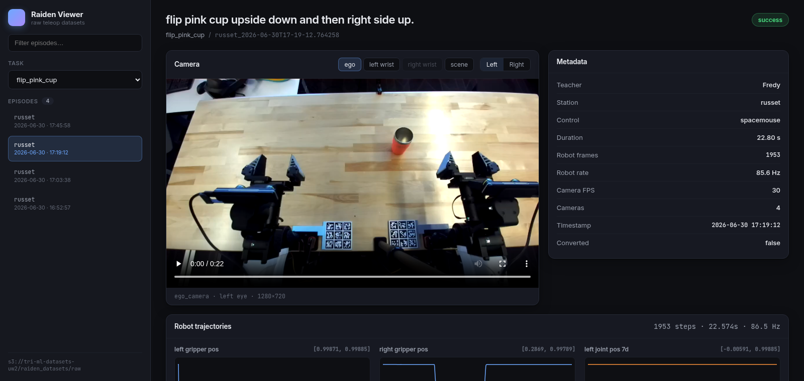

# Raiden Dataset Viewer

A lightweight web viewer for **raw Raiden robot teleop datasets** stored on S3.
Browse tasks and episodes, play the camera recordings, and inspect metadata,
calibration, and robot trajectories — all from a browser, no local downloads.



## What it shows

Each episode lives at `s3://<bucket>/<prefix>/<task>/<episode>/` and contains:

| File | Contents |
| --- | --- |
| `metadata.json` | task instruction, teacher, station, duration, robot rate, camera list |
| `calibration_results.json` | per-camera intrinsics + extrinsics + hand-eye calibration |
| `robot_data.npz` | bimanual joint / gripper trajectories (~85 Hz) |
| `cameras/*.svo2` | ZED stereo camera recordings |

The viewer renders the video, a metadata panel, per-signal trajectory plots, and
a calibration summary.

## The `.svo2` decode (no ZED SDK required)

The `.svo2` files are **MCAP containers**, not opaque ZED blobs. The image
channel (`.../side_by_side`) carries an **H.264 Annex-B** elementary stream —
one MCAP message per frame, each payload prefixed with an 8-byte header
(`uint32 total_len`, `uint32 h264_len`):

```
[total_len][h264_len][ h264_len bytes of Annex-B ][ trailing ]
```

`raiden_viz` concatenates the H.264 payloads across frames, hands the raw stream
to `ffmpeg`, crops to a single eye (the stream is side-by-side stereo, e.g.
2560×720 → two 1280×720 eyes), and muxes to a web-streamable MP4. This means the
only dependencies are `mcap` (pip) and `ffmpeg` — **the proprietary ZED SDK is
not needed**.

Decoded clips are cached on disk (keyed by the S3 ETag) so repeat views are
instant.

## Running

Requirements: `ffmpeg` on PATH, AWS credentials with read access to the bucket,
and [`uv`](https://github.com/astral-sh/uv).

```bash
./run.sh                      # serve on 0.0.0.0:8080
RAIDEN_PORT=9000 ./run.sh     # custom port
```

Then open `http://<host-ip>:8080/`. Episode links are shareable via the URL hash
(`#<task>/<episode>`).

## Configuration (environment variables)

| Var | Default | Meaning |
| --- | --- | --- |
| `RAIDEN_S3_BUCKET` | `tri-ml-datasets-uw2` | S3 bucket |
| `RAIDEN_S3_PREFIX` | `raiden_datasets/raw` | prefix under which `<task>/<episode>/` live |
| `RAIDEN_AWS_REGION` | `us-west-2` | bucket region |
| `RAIDEN_HOST` | `0.0.0.0` | bind host |
| `RAIDEN_PORT` | `8080` | bind port |
| `RAIDEN_CACHE_DIR` | `/tmp/raiden_viz_cache` | disk cache for `.svo2` + `.mp4` |
| `RAIDEN_CACHE_MAX_GB` | `20` | cache size cap (LRU eviction; `0` disables) |

## HTTP API

| Endpoint | Returns |
| --- | --- |
| `GET /api/tasks` | task folder names |
| `GET /api/tasks/{task}/episodes` | episode folder names (newest first) |
| `GET /api/tasks/{task}/episodes/{episode}` | metadata + calibration + camera list + robot trajectory summary |
| `GET /api/tasks/{task}/episodes/{episode}/video?camera=&eye=left\|right` | decoded MP4 (transcodes + caches on first request) |
| `GET /api/health` | liveness + configured bucket/prefix |

## Layout

```
raiden_viz/
  app.py          FastAPI routes
  s3.py           S3 browse / fetch helpers
  svo.py          .svo2 (MCAP + H.264) -> MP4 decoder
  robot_data.py   robot_data.npz -> plot-ready series
  cache.py        disk cache with per-key locks + LRU eviction
  config.py       env-var configuration
static/           self-contained frontend (no build step)
Dockerfile        python:3.12-slim + ffmpeg + gunicorn
docker-compose*.yml   local-build and prod-ECR compose files
gunicorn.conf.py  gunicorn + UvicornWorker production config
.github/workflows/    CI: build on push, push to ECR on main
```

## Hosting for others (TRI-internal)

This follows the same pattern as [AnyFile](https://github.com/TRI-ML/AnyFile):
a Docker image is pushed to ECR by CI, then run on an internal EC2 host that
TRI users reach over the VPN by an `*.awsinternal.tri.global` name.

> **Networking reality:** this app binds `0.0.0.0` and has no firewall in its
> way, but the box it's developed on (`puget`, `10.110.20.242`) is on the
> compute subnet, which laptops off that subnet / VPN pool can't route to.
> That's why "share the internal IP" doesn't reach everyone — hosting on a
> VPN-routable EC2 host (below) is what makes it broadly accessible.

### Run it in Docker locally (verify the image)

TRI laptops authenticate to AWS via **SSO**, not static keys, so first resolve
the current session into env vars (this also covers `~/.aws` profiles and plain
env creds), then build:

```bash
eval "$(aws configure export-credentials --format env)"
docker compose -f docker-compose-local.yml up --build
# -> http://localhost:8080/
```

If `docker` needs root on your box (you're not in the `docker` group), use
`sudo -E` so the exported creds survive into the sudo environment:

```bash
eval "$(aws configure export-credentials --format env)"
sudo -E docker compose -f docker-compose-local.yml up --build
```

If your sudoers config strips the env anyway, inline the export instead:

```bash
sudo docker compose -f docker-compose-local.yml build   # build needs no creds
eval "$(aws configure export-credentials --format env)"
sudo AWS_ACCESS_KEY_ID="$AWS_ACCESS_KEY_ID" \
     AWS_SECRET_ACCESS_KEY="$AWS_SECRET_ACCESS_KEY" \
     AWS_SESSION_TOKEN="$AWS_SESSION_TOKEN" \
     docker compose -f docker-compose-local.yml up
```

SSO session creds are temporary (typically a few hours); re-run the `eval` and
restart the container when they expire.

A cold video request downloads the `.svo2` from S3 and transcodes with the
ffmpeg baked into the image; subsequent requests are served from the cache
volume.

### Deploy to EC2 via ECR (production)

CI (`.github/workflows/docker-image-ecr.yml`) builds on every push and, on
`main`, pushes `latest` + `sha-<commit>` to ECR in `us-west-2`. To roll it out:

```bash
# On the EC2 host:
aws ecr get-login-password --region us-west-2 \
  | docker login --username AWS --password-stdin <ACCOUNT_ID>.dkr.ecr.us-west-2.amazonaws.com

export RAIDEN_IMAGE=<ACCOUNT_ID>.dkr.ecr.us-west-2.amazonaws.com/raiden-viz:latest
docker compose pull && docker compose up -d
```

The prod `docker-compose.yml` mounts a persistent volume at `/data/cache` and
relies on the instance's IAM role for S3 access (no creds in the file).

### ⚠️ Steps that need a human with infra access (I can't do these)

These require credentials/permissions the dev environment doesn't have:

1. **ECR repo** — create `raiden-viz` in the target AWS account (`us-west-2`).
   Confirm the `AWS_ACCOUNT_ID` in the CI workflow (it defaults to AnyFile's
   `682769330988` — change if raiden-viz lives elsewhere).
2. **CI OIDC role** — ensure `TRI-Actions/get-aws-credentials` can assume a role
   with ECR push rights for this repo (same mechanism AnyFile uses).
3. **EC2 host** — an instance whose IAM role can read `tri-ml-datasets-uw2`,
   with your SSH key added (AnyFile's README says contact **sunny.sun@tri.global**
   or **basile**). Install Docker + compose, clone this repo, run the commands above.
4. **Internal DNS** — a record like `raiden-viz.us-west-2.awsinternal.tri.global`
   pointing at the instance (front with HTTPS/nginx as AnyFile does).

Everything in the repo (Dockerfile, compose, CI, gunicorn) is written and
verified as far as is possible without Docker-daemon or AWS-infra access:
the exact container command (`gunicorn ... -c gunicorn.conf.py`) has been run
locally and confirmed to serve the UI and decode video end-to-end.
